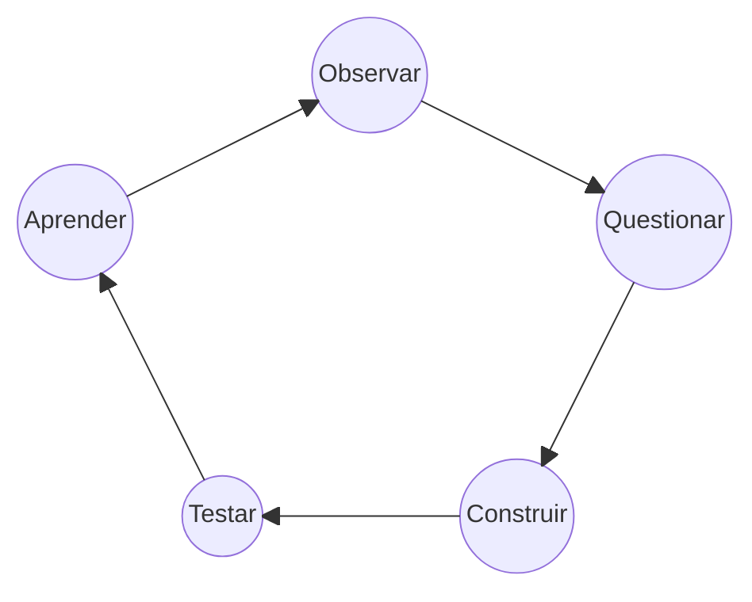

<p align="center">
  <br>
  <em>Onde termina o conhecido, começa a busca.</em><br>
  
</p>

## ◈ Transmissão 001

| Sinal | Dados recebidos |
| :--- | :--- |
| **Origem** | São Paulo, Brasil |
| **Identidade** | Migliatti |
| **Estado** | Estudando, experimentando e construindo |
| **Direção** | Backend · Sistemas · Inteligência Artificial |
| **Formação** | Ciência da Computação |
| **Princípio** | Construir para compreender |

## ◈ Sobre

Sou estudante de **Ciência da Computação** e trabalho com **Suporte de T.I.**

Gosto de investigar como sistemas funcionam, desmontar problemas e transformar ideias em coisas que possam ser executadas, testadas e melhoradas.

Não estou aqui porque tenho todas as respostas. Estou aqui porque procurar por elas é a parte interessante.

## ◈ Constelação tecnológica

<table>
<tr>
<td align="center" width="33%">
<strong>☉ Núcleo</strong><br>
<br>
<sub>Linguagens e execução</sub>
</td>
<td align="center" width="33%">
<strong>◉ Dados</strong><br>
<br>
<sub>SQL e persistência</sub>
</td>
<td align="center" width="33%">
<strong>◎ Ambiente</strong><br>
<br>
<sub>Construção e infraestrutura</sub>
</td>
</tr>
</table>

<p align="center"><sub>Tecnologias não são troféus — são instrumentos de investigação.</sub></p>

```text
                APRENDENDO                    CONSTRUINDO

          lógica e algoritmos          aplicações web e APIs
          estruturas de dados          automações e integrações
          bancos de dados              experimentos assistidos por IA
          engenharia de software       projetos que sobrevivam ao protótipo
```

## ◈ Áreas de exploração

<table>
<tr>
<td width="50%" valign="top">
<strong>Sistemas</strong><br><br>
APIs, arquitetura backend, bancos de dados, testes, logs e tudo aquilo que geralmente só recebe atenção quando para de funcionar.
</td>
<td width="50%" valign="top">
<strong>Inteligência artificial</strong><br><br>
Orquestração, automação, verificação e maneiras de construir com IA sem terceirizar completamente o raciocínio.
</td>
</tr>
<tr>
<td width="50%" valign="top">
<strong>Ciência da Computação</strong><br><br>
Fundamentos, algoritmos, matemática e o estudo das ideias escondidas por baixo das abstrações modernas.
</td>
<td width="50%" valign="top">
<strong>Experimentos</strong><br><br>
Projetos pequenos, hipóteses estranhas e tentativas suficientemente concretas para poderem falhar de maneira útil.
</td>
</tr>
</table>

## ◈ Protocolo de construção



> IA pode acelerar a construção.  
> Compreensão continua sendo responsabilidade de quem constrói.

## ◈ Sinal atual

```bash
$ ./observe --subject=migliatti

curiosity       ████████████████████  active
experiments     ███████████████░░░░░  running
certainty       ██░░░░░░░░░░░░░░░░░  intentionally_low
coffee          █████████░░░░░░░░░░░  insufficient
```

<p align="center">
  <sub>Nem tudo que exploro vira projeto.<br>Todo projeto, porém, muda a forma como exploro.</sub><br>
  
</p>
